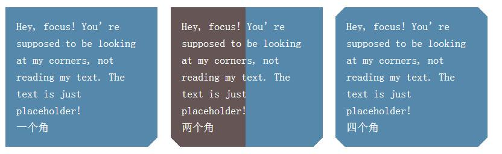
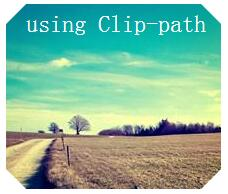

## 切角效果

>把角切掉不仅省钱，它还是一种非常流行的设计风格,最常见的是把一个或多个角切成45°的缺口--斜面切角。当应用在某一侧的时候切角的尺寸刚好为高度的50%时，就会得到一个箭头的形状。

```html
<div>Hey, focus! You’re supposed to be looking at my corners, 
not reading my text. The text is just placeholder!</div>

```

```css
/*通用样式*/
div{
	display: inline-block;
	margin:.5em;
	padding: 1em;
	max-width: 12em;
	color: white;
	font:150%/1.6 Baskerville,Palatino,serif;
}
```

#### 解决方案一，css渐变



```css

div{
	/*第一行不是必需的，加上它是将其作为回退机制；如果默写浏览器不支持CSS渐变，第二行声明会被丢弃。*/
	background: #58a;
	background: linear-gradient(-45deg,transparent 15px,#58a 0);
}

/* 同理两个切角 */
div{
	background: #58a;
	background: linear-gradient(-45deg,transparent 15px,#58a 0) right,
				linear-gradient(45deg,transparent 15px,#655 0) left;
	/*还需要加上Size和No-repeat*/
	background-size:50% 100%;
	background-repeat:no-repeat;  
}
/*四个切角*/
div{
	background: #58a;
    background: linear-gradient(135deg,transparent 15px,#58a 0)  top left,
			    linear-gradient(-135deg,transparent 15px,#58a 0) top right,
                linear-gradient(-45deg,transparent 15px,#58a 0) bottom right,
			    linear-gradient(45deg,transparent 15px,#58a 0) bottom left;
    background-size:50% 50%;
    background-repeat:no-repeat;
}

```


##### 弧形切角 “内凹圆角” -- 径向渐变代替


```css
div{
	background: #58a;
	background:	radial-gradient(circle at top left, transparent 15px, #58a 0) top left,
	          	radial-gradient(circle at top right, transparent 15px, #58a 0) top right,
	          	radial-gradient(circle at bottom right, transparent 15px, #58a 0) bottom right,
	          	radial-gradient(circle at bottom left, transparent 15px, #58a 0) bottom left;
	background-size: 50% 50%;
	background-repeat: no-repeat;
}
```


#### 内联SVG 与 border-image方案

>渐变（在某些浏览器下比较繁琐冗长）往往4个角的切角尺寸是一致的，但我们仍然需要修改4个角。


```css
div{
	border: 21px solid transparent;
    border-image: 1 url('data:image/svg+xml,\
	              	  <svg xmlns="http://www.w3.org/2000/svg" width="3" height="3" fill="%2358a">\
	                  <polygon points="0,1 1,0 2,0 3,1 3,2 2,3 1,3 0,2" />\
	                  </svg>'
	                  );
    background: #58a;
    background-clip: padding-box;
}

```
#### 裁切路径方案



```css
div{
	background-image: url(img/timg.jpg);
	clip-path: polygon(20px 0, calc(100% - 20px) 0, 100% 20px, 100% calc(100% - 20px), calc(100% - 20px) 100%, 20px 100%, 0 calc(100% - 20px), 0 20px);
}
```